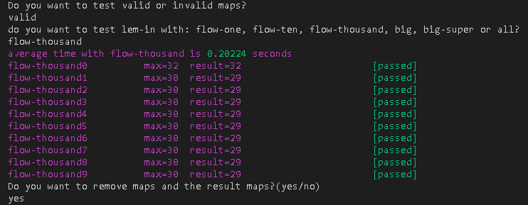

# Tester Lem-in

This is a script to test your lem-in on valid and invalid maps. Works on Linux and on MacOS.

## Prerequisites

Put your lem-in executable in this folder. If you want to use it on MacOS, change in make_maps './linux_gen' to './generator'.

## Usage

1&nbsp;&nbsp;&nbsp;&nbsp;&nbsp;&nbsp;Run the following command:
```bash
$ ./script
```
2&nbsp;&nbsp;&nbsp;&nbsp;&nbsp;&nbsp;You will be asked if you want to test your lem-in on valid or invalid maps

3&nbsp;&nbsp;&nbsp;&nbsp;&nbsp;&nbsp;If you choose invalid, it will test all the maps given in the invalid_map directory.<br />&nbsp;&nbsp;&nbsp;&nbsp;&nbsp;&nbsp;&nbsp;&nbsp;It will print the name of the map and if you passed(max 1 line of output) or failed(more than 1 line of output).<br />&nbsp;&nbsp;&nbsp;&nbsp;&nbsp;&nbsp;&nbsp;&nbsp;Than the script is finished.

&nbsp;&nbsp;&nbsp;&nbsp;&nbsp;&nbsp;&nbsp;&nbsp;If you choose valid, you will be asked with which maps you want to test you lem-in (flow-one, flow-ten, flow-thousand, big ,<br />&nbsp;&nbsp;&nbsp;&nbsp;&nbsp;&nbsp;&nbsp;&nbsp;big-super or all).


4&nbsp;&nbsp;&nbsp;&nbsp;&nbsp;&nbsp;The maps will be generated and saved in a directory with the name of the category.

5&nbsp;&nbsp;&nbsp;&nbsp;&nbsp;&nbsp;It runs your lem-in with those maps and will first print the average time it takes your lem-in to execute the maps of the specified category.<br />&nbsp;&nbsp;&nbsp;&nbsp;&nbsp;&nbsp;&nbsp;&nbsp;The results  will be saved in a directory with 'name of the category'-results.

6&nbsp;&nbsp;&nbsp;&nbsp;&nbsp;&nbsp;Then it will print: the name of the map, the number of lines required, how many lines your lem-in used and<br />&nbsp;&nbsp;&nbsp;&nbsp;&nbsp;&nbsp;&nbsp;&nbsp;if you passed(equal or less then lines required) or failed(more than required lines).

7&nbsp;&nbsp;&nbsp;&nbsp;&nbsp;&nbsp;You will be asked if you want to remove the maps and maps-results.

8&nbsp;&nbsp;&nbsp;&nbsp;&nbsp;&nbsp;If you chose to run it with 'all', it runs step 4 till 7 for each category.

## Example of the result


